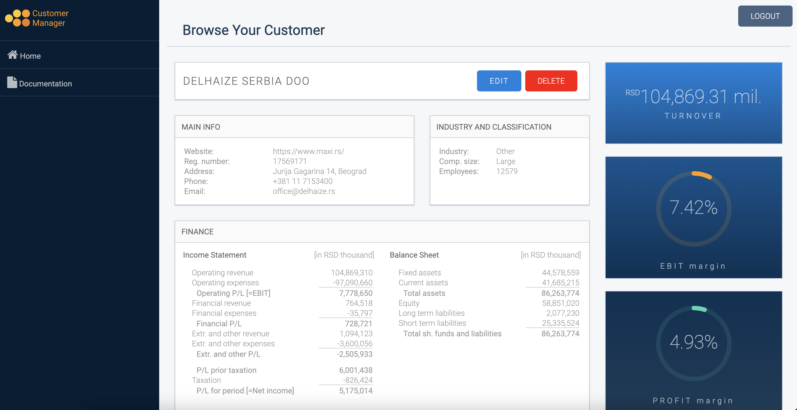

# Customer Manager

> This simple CRUD app is designed to help you to manage your customers by conducting comparative financial analysis.

## How it is built?

- HTML and CSS / SCSS;
- ReactJS (React hooks and React Router DOM), Redux, Redux Saga;
- React testing with Jest;
- Firebase.

## Contents

- **Login page (public)**
  - Login with front end validation.
  - Every time a user signs in, the user credentials are sent to the Firebase Authentication backend and exchanged for a Firebase ID token. Firebase ID tokens are kept in local storage (note that these tokes are short lived and last for an hour).
- **Home page (private)**
  - It's paginated and contains list of all customers fetched from Firebase.
  - Search, sort and filter tools are available.
- **Create customer page (private)**
  - Contains application form divided in three sections - main info, industry and classification and financial data.
  - Form validation provided (all fields are required, textual fields must have min 3 characters, all numerals must be positive, phone and email validation).
- **View customer page (private)**
  - Breakdown of particular customer's data. Beside the ones required by application form, also contains numerous financial ratios that are calculated on the basis of provided data.
  - Contains buttons for editing and deleting customer.
  - By clicking on the delete button user opens a delete modal. Deleting from Firebase is permanent.
- **Edit customer page (private)**
  - Shares the same application form and UI as Create customer page.
- **Documentation page (private)**

  - Text with explanations how to use and interpret results obtained from the app.

<div align="center" markdown="1">





</div>

## Usage

Enter login credentials and start exploring available tools.

### 1. Login Credentials

```
$ email: admin@admin.com
```

```
$ password: admin123
```

### 2. How to use available tools in this app?

This app allows you to create, retrieve, update and delete customers. For each customer you can keep data such as contact details, industry classification and size, as well as their financials.

##### ** CREATE PARTICULAR CUSTOMER **

- You can create customer by filling an application form. Data required by form for each particular customer can be found on Serbian Business Register Agency and includes data from official financial statements (e.g. registration number, phone, email, size, turnover, operating expenses, taxation, fixed assets, etc).

##### ** VIEW, SEARCH, SORT and FILTER ALL CUSTOMERS **

- All customers stored in database are available for view and simultaneous searching/sorting/filtering.
- Customers can be searched by their name.
- Sorting is allowed per customer's name or turnover (in both cases
  ascending or descending).
- There is possibility to filter customers per industry they
  belong or per company size.

##### ** VIEW, EDIT or DELETE PARTICULAR CUSTOMER **

- By clicking on each customer you can access to its detail overview - besides the data required by application form, you may find numerous financial ratios which can ease your analysis and help you in decision-making process.
- For each customer there are additional options for EDIT or DELETE (please note that deleting is not reversible and that customer is permanently removed from database).

##### ** READ the DOCUMENTATION PAGE **

- Read more about ratios to help you to interpret results!

Enjoy! 🚀 🚀 🚀
